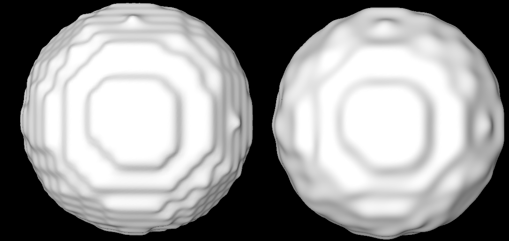

# adapt_object_mesh

[](https://hub.docker.com/r/fnndsc/pl-adapt_object_mesh)
[](https://github.com/FNNDSC/pl-adapt_object_mesh/blob/main/LICENSE)
[](https://github.com/FNNDSC/pl-adapt_object_mesh/actions/workflows/ci.yml)



`pl-adapt_object_mesh` is a [_ChRIS_](https://chrisproject.org/)
_ds_ plugin wrapper for
[`adapt_object_mesh`](https://github.com/aces/surface-extraction/blob/clasp_3-0-3/src/adapt_object_mesh.c),
a polygonal mesh smoothing program from [CIVET](http://mcin.ca/technology/civet/).
It implements 
It runs `adapt_object_mesh` on every `.obj` file in its input directory,
writing outputs to an output directory, and printing logs to log files
which are created next to the output surfaces.

## Installation

`pl-adapt_object_mesh` is a _[ChRIS](https://chrisproject.org/) plugin_, meaning it can
run from either within _ChRIS_ or the command-line.

[](https://chrisstore.co/plugin/pl-adapt_object_mesh)

## Local Usage

To get started with local command-line usage, use [Apptainer](https://apptainer.org/)
(a.k.a. Singularity) to run `pl-adapt_object_mesh` as a container.
To print its available options, run:

```shell
apptainer exec docker://fnndsc/pl-adapt_object_mesh adapt_object_mesh_wrapper --help
```

## Example

```shell
singularity exec docker://fnndsc/pl-adapt_object_mesh:latest adapt_object_mesh_wrapper --iterations 50 incoming/ outgoing/
```
